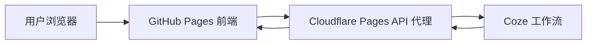

# AI 新闻助手

一个面向 AI 从业者与资讯关注者的智能新闻 Web 应用：通过对话、每日播客和新闻摘要，帮助用户更高效地获取与理解 AI 行业动态。

[](https://yhao-l.github.io/ai-news-assistant/)
[](https://github.com/Yhao-L/ai-news-assistant/actions/workflows/deploy.yml)
[](https://react.dev/)
[](LICENSE)

> 在线体验：[https://yhao-l.github.io/ai-news-assistant/](https://yhao-l.github.io/ai-news-assistant/)

## 项目背景

AI 产品经理和行业从业者每天需要浏览多个平台来追踪热点，信息来源分散、筛选成本较高。本项目通过 Coze 工作流聚合和处理资讯，并以对话、播客和摘要三种方式呈现，帮助用户快速把握重点。

## 核心功能

| 功能 | 说明 |
| --- | --- |
| AI 新闻对话 | 支持自然语言提问、上下文对话、Markdown 回复与历史记录管理 |
| AI 每日播客 | 生成每日精选新闻内容和音频，内置播放、音量与进度控制 |
| 每日新闻推送 | 一键生成当日 AI 新闻摘要，支持 Markdown 排版和重新生成 |
| 响应式界面 | 适配桌面端、平板和移动设备 |

## 界面预览

<p align="center">
  
</p>

<p align="center">
  
</p>

### 视频演示

https://github.com/user-attachments/assets/b4015c46-34ae-4287-a4ee-67bed49a3349

## 工作原理



- React 前端部署在 GitHub Pages，并由 GitHub Actions 自动构建。
- 前端只访问 Cloudflare Pages 代理，不直接携带 Coze Token。
- `COZE_API_TOKEN` 作为 Cloudflare 加密 Secret 保存，不会进入仓库或公开的 JavaScript 构建产物。
- 代理限制允许的来源、工作流和请求体大小，降低公开接口被滥用的风险。

## 技术栈

- React 18、React Context API
- Tailwind CSS、Lucide React
- Axios、React Markdown
- Cloudflare Pages Advanced Mode
- GitHub Actions、GitHub Pages
- Coze 工作流 API

## 快速开始

### 环境要求

- Node.js 18 或更高版本
- npm

### 本地运行

```bash
git clone https://github.com/Yhao-L/ai-news-assistant.git
cd ai-news-assistant
npm install
npm start
```

浏览器访问 [http://localhost:3000](http://localhost:3000)。默认配置会使用已经部署的 Cloudflare Pages 代理。

### 生产构建

```bash
npm run build
```

构建产物会生成在 `build/` 目录。

## 配置说明

如需连接自己的代理，可在本地环境变量中配置：

```bash
REACT_APP_API_BASE_URL=https://your-proxy.example.com/v1/workflows/chat
```

`REACT_APP_*` 变量会被编译进公开前端，因此不能用于存放 Token。Coze Token 应配置为 Cloudflare Pages 项目中的加密 Secret：

```text
COZE_API_TOKEN
```

更新方法请参阅 [Token 更新指南](./Token更新指南.md)。

## 项目结构

```text
ai-news-assistant/
├── .github/workflows/       # GitHub Pages 自动部署
├── pages-proxy/             # Cloudflare Pages API 代理
├── public/                  # HTML 模板与静态资源
├── src/
│   ├── components/          # 对话、播客、每日推送等界面
│   ├── config/              # API 与工作流配置
│   ├── contexts/            # React 状态管理
│   ├── services/            # API 请求与 SSE 响应解析
│   ├── theme/               # 主题配置
│   └── utils/               # 数据迁移与错误处理
├── config-checker.js        # 代理和工作流配置检查
└── package.json
```

## 部署

推送到 `main` 分支后，GitHub Actions 会自动完成安装、构建并发布到 `gh-pages` 分支。

```bash
git push origin main
```

相关文档：

- [部署指南](./部署指南.md)
- [Token 更新指南](./Token更新指南.md)
- [Cloudflare Pages 代理说明](./pages-proxy/README.md)
- [项目文件说明](./项目文件说明.md)

## AI 协作记录

<details>
<summary>查看项目创建、后端构建、调试与部署过程</summary>

### 创建前端


### 构建后端


### 调试


### 提交部署


</details>

## 贡献

欢迎通过 [Issues](https://github.com/Yhao-L/ai-news-assistant/issues) 提交问题或建议，也欢迎创建 Pull Request。

## 许可证

本项目采用 [MIT License](LICENSE)。
